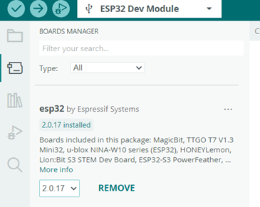
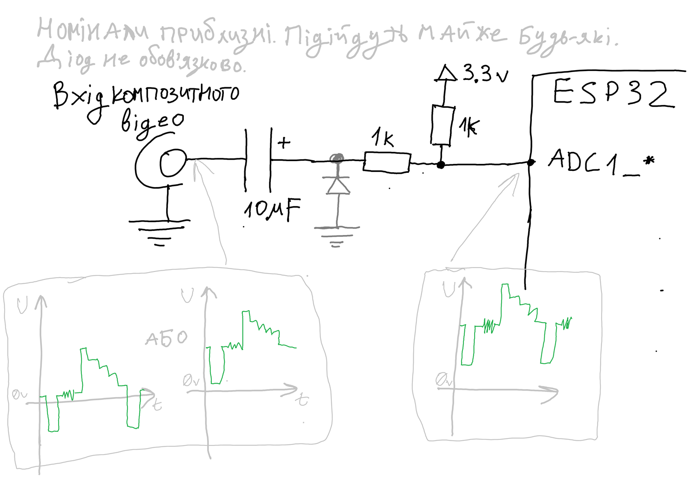
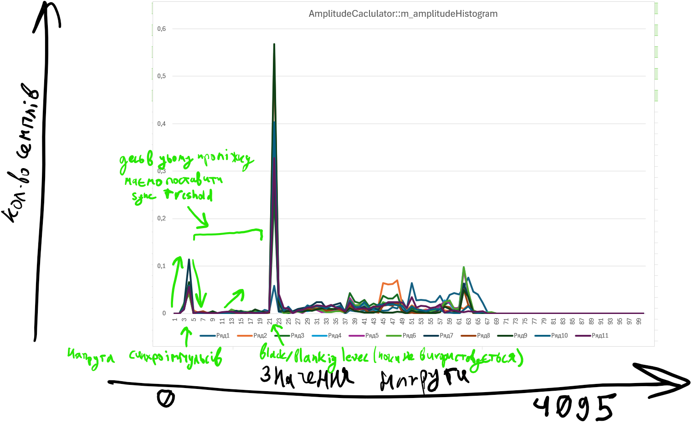
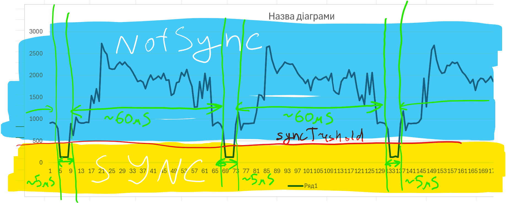
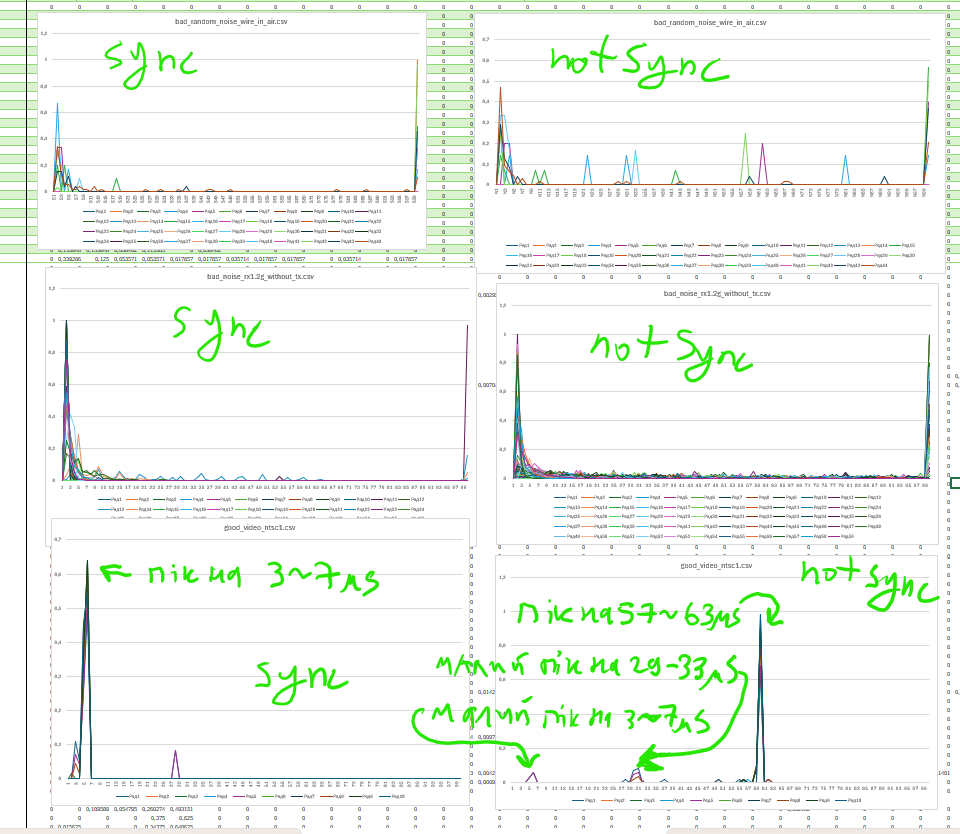
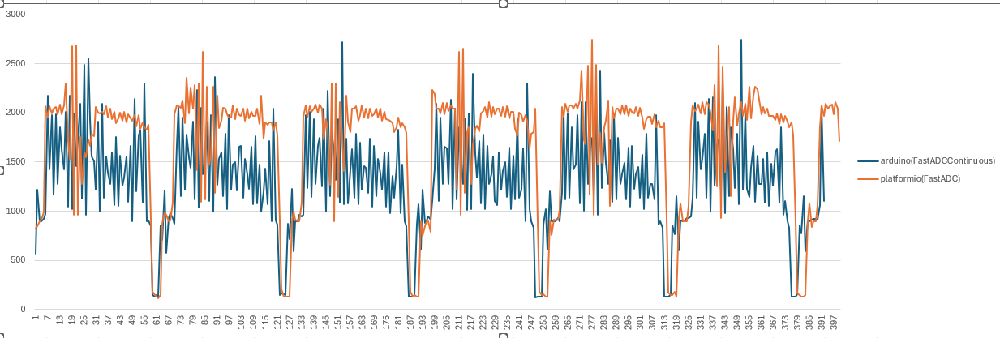

# Код для оцінки сигналу який поступає на АЦП esp32, чи є він аналоговим відео, чи ні.

## Підтримка версій IDE IDE:
- Platformio+VSCode:
    - Використовується старий драйвер ADC, ще без continuous mode, через I2S. (файли FastADC.cpp/h)
    - Platform espressif32 @ 6.10.0
    - framework-arduinoespressif32 @ 3.20017.241212+sha.dcc1105b (https://github.com/platformio/platform-espressif32)
        - Contains Arduino support - v2.0.17 (based on IDF v4.4.7)
        - Contains ESP-IDF support(without arduino) - v5.4.0
- Arduino IDE 2.3.6
    - esp32 пакет 3.2.0 новий драйвер adc_continuous (файли FastADCContinuous.cpp/h)
	- esp32 пакет 3.0.0 ймовірно теж але треба перевірити
	- також працює в не-continuous режимі якщо в arduino IDE завантажений пакет esp версії **2.0.17** і в ньому руками заглушен варнінг збірки в \AppData\Local\Arduino15\packages\esp32\hardware\esp32\2.0.17\tools\sdk\esp32\include\hal\esp32\include\hal\i2s_ll.h:766
		
			
		
		```
		static inline void i2s_ll_rx_get_pdm_dsr(i2s_dev_t *hw, i2s_pdm_dsr_t *dsr)
		{
			//to silence build error
			//*dsr = hw->pdm_conf.rx_sinc_dsr_16_en;
			*dsr = (i2s_pdm_dsr_t)hw->pdm_conf.rx_sinc_dsr_16_en;
		}
		```

## Підключення: 

- Тільки ADC1 входи!

- Відеосигнал має бути DC-coupled, тобто завжди >0вольт відносно землі, навіть підчас синхроімпульса!
Для цьго можна задіяти просту схему:


## Алгоритм:

- З частотою 1-2МГц зчитуємо напругу з АЦП. Масивами по 400-1000 семплів.
- в PreProcessBuf відкидаємо 4 біта з 16-бітної змінної, бо роздільна здатність АЦП 12біт. Тут же за потреби інвертуємо по формулі y=4095-x
- AmplitudeCalculator накопичує бажану кількість семплів в свою гістограму напруги. (з відкиданням усіх 0 та 4095 значень які йдуть на початку масиву. Через хаки якими налаштовуємо АЦп вже після початку семплінгу а потім робимо zeroDma, неактуальні дані можуть бути затерті нулями) (З пропуском семплів черрез один, дивись k_adcDataStrideSamples. Теж наслідок привого драйверу АЦП, експериментально визначено з так найменш шумні дані).
- AmplitudeCalculator проводить пошук погорового значення синхроімпульса: на гістограмі напруги шукає саму ліву послідовність risingEdge->fallingEdge->risingEdge. Середина між початковими точками другого та третього edge - визначається як syncTreshold
    
- Коли порогове значення визначено, далі пушимо семпли в SyncIntervalsCalculator. Який одразу робить такі операції: знаходить інтервали коли напруга відносить до sync або до notSync. Довжину інтервалів не зберігає, а одразу додає до одної з двох гістограм, де зберігається кількість скільки зустрілось інтервалів довжиною в N мікросекунд(або семплів). не повні інтервали на початку/кінці запису відкидаються.

- Коли накопичена деяка кількість цієї статистики, дві гістограми передаються в клас VideoScore для ітогової оцінки. 
Приклади гістограм: 

Ітогова оцінка складається з:
    - на 70% з не-синхро інтервалів довжиною 57-63us (макс оцінка якщо до них відносяться 80% інтервалів)
    - на 20% з синхро-інтервалів 5-7us (макс оцінка якщо до них відносяться 60% інтервалів)
    - на 5% з не-синхро інтервалів довжиною 29-33us (макс оцінка якщо до них відносяться 20% інтервалів)
    - на 5% з не-синхро інтервалів довжиною 5-7us (макс оцінка якщо до них відносяться 20% інтервалів)
- В ідеалі усі ці коефіціенти мав би підбирати ШІ, але мені не вдалось його нормально задіяти, тож підібрав такі. Кожен з елементів алгоритма є state-machine, усі датасети друкуються в форматі CSV, тому мало б бути хоч всю систему повністю перетворити в нейронку.
- Якщо будь-який з компонентів зафейлився, наприклад недостатньо семплів, не вдалось знайти порогове значення, і т.д. то оцінка доразу виставляється 0.0

## Швидкодія:

Наразі це 12-13мс на прохід одного канала АЦП без інверсії. Тобто х2 якщо перевіряти також з інверсієй. Можна пробувати знижувати, наприклад k_minSamplesForCalculationUs, і вкластить в <10мс.
```
m_stateProfilers.k_amplitudeSampling	5715us
m_stateProfilers.k_amplitudeCalculation	171us
m_stateProfilers.k_syncIntervalsSampling	3276us
m_stateProfilers.k_syncIntervalsCalculation	3045us
m_stateProfilers.k_videoScoreCalculation	195us
m_stateProfilers.k_restartInverted	0us
m_stateProfilers.k_stopADC	1498us
m_stateProfilers.k_finished	0us
m_stateProfilers.k_totalAnalyzeTime	13339us
```

Можлива асинхронна робота, приклад:
```

CvbsAnalyzer g_cvbsAnalyzer;
CvbsAnalyzerDispatcher g_cvbsAnalyzerDispatcher(&g_cvbsAnalyzer);
CvbsAnalyzerJob g_pin35Job(CvbsAnalyzerJobType::k_videoScore, 35);
CvbsAnalyzerJob g_pin36Job(CvbsAnalyzerJobType::k_videoScore, 36);
g_cvbsAnalyzer.InitializeFastADC();
g_cvbsAnalyzerDispatcher.StartWorkerThread();

g_cvbsAnalyzerDispatcher.RequestJob(&g_pin35Job);
g_pin35Job.WaitUntilDone();
CVBS_ANALYZER_LOG_INFO("m_videoScore.m_isVideo=%f\n", g_pin35Job.m_videoScore.m_isVideo);

//або

while(!g_pin35Job.IsDone()) {}
CVBS_ANALYZER_LOG_INFO("m_videoScore.m_isVideo=%f\n", g_pin35Job.m_videoScore.m_isVideo);
```


## Приклад результату роботи

- На пін 36 підключено якісне не-інвертоване відео. Пін 35 висить в повітрі:
    ```
    Reading pin 35          : m_videoScore.m_isVideo=0.000000 m_videoScoreInverted.m_isVideo=0.000000
	Reading pin 36          : m_videoScore.m_isVideo=0.420000 m_videoScoreInverted.m_isVideo=0.050000

	Reading pin 35          : m_videoScore.m_isVideo=0.000000 m_videoScoreInverted.m_isVideo=0.000000
	Reading pin 36          : m_videoScore.m_isVideo=0.909259 m_videoScoreInverted.m_isVideo=0.050000

	Reading pin 35          : m_videoScore.m_isVideo=0.000000 m_videoScoreInverted.m_isVideo=0.000000
	Reading pin 36          : m_videoScore.m_isVideo=0.700000 m_videoScoreInverted.m_isVideo=0.700000

	Reading pin 35          : m_videoScore.m_isVideo=0.000000 m_videoScoreInverted.m_isVideo=0.000000
	Reading pin 36          : m_videoScore.m_isVideo=0.704464 m_videoScoreInverted.m_isVideo=0.053115

	Reading pin 35          : m_videoScore.m_isVideo=0.000000 m_videoScoreInverted.m_isVideo=0.000000
	Reading pin 36          : m_videoScore.m_isVideo=0.866667 m_videoScoreInverted.m_isVideo=0.050000

	Reading pin 35          : m_videoScore.m_isVideo=0.000000 m_videoScoreInverted.m_isVideo=0.000000
	Reading pin 36          : m_videoScore.m_isVideo=0.700000 m_videoScoreInverted.m_isVideo=0.050000
	```


Необроблені дані з platformio зі старим драйвером, і arduino з новим:


